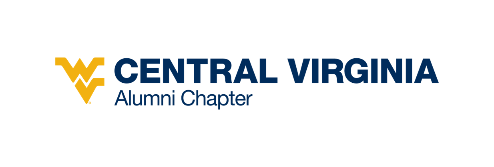

# WVU Design System Implementation Plan
**Date:** October 20, 2025  
**Website:** cvawvuaa.org  
**Purpose:** Implement official WVU Design System components and templates to achieve 100% brand compliance

---

## Executive Summary

The WVU Design System provides official HTML, CSS, and JavaScript components that should replace our current custom implementations. This document outlines which components are most relevant for the Central Virginia Alumni Chapter website and provides implementation priorities.

**Key Resources:**
- Components: https://designsystem.wvu.edu/components
- Templates: https://designsystem.wvu.edu/templates
- GitHub Repo: https://github.com/wvuweb/wvu-design-system-v2

---

## Current vs. WVU Design System Analysis

### What We Have Now
- Custom navigation with mobile menu toggle
- Custom hero sections with CTA buttons
- Card-based event listings
- Manual footer implementation
- Custom contact forms
- Profile spotlights (alumni)
- Custom CSS (1186 lines)

### What WVU Design System Offers
- **Essential Elements:** Standardized masthead, navigation, footer, breadcrumbs
- **Call to Action:** 6 hero variants optimized for different purposes
- **Collections:** Pre-built card grids, event calendars, people listings
- **Profiles:** 3 hero variants + testimonials + photo grids
- **Templates:** 17 complete page templates for common scenarios

---

## High-Priority Components for Alumni Chapter

### 1. ESSENTIAL ELEMENTS (Must Implement)

#### ✅ Masthead
**URL:** https://designsystem.wvu.edu/components/essential-elements/masthead  
**Current:** Custom header with logo  
**Benefit:** Official WVU lockup, proper spacing, responsive design  
**Impact:** HIGH - Ensures brand consistency across all WVU sites  
**Effort:** 2-3 hours

#### ✅ Primary Navigation
**URL:** https://designsystem.wvu.edu/components/essential-elements/nav  
**Current:** Custom nav with JavaScript toggle  
**Benefit:** Accessible mobile menu, keyboard navigation, ARIA labels  
**Impact:** HIGH - Better UX + accessibility compliance  
**Effort:** 3-4 hours

#### ✅ Footer
**URL:** https://designsystem.wvu.edu/components/essential-elements/footer  
**Current:** Custom footer with social links  
**Benefit:** Standard WVU footer with required links (Privacy, Accreditations)  
**Impact:** HIGH - Legal compliance + brand consistency  
**Effort:** 2 hours

#### ⚠️ Breadcrumbs
**URL:** https://designsystem.wvu.edu/components/essential-elements/breadcrumbs  
**Current:** None  
**Benefit:** Better navigation, SEO improvement  
**Impact:** MEDIUM - Helpful for multi-level pages  
**Effort:** 1 hour per page

---

### 2. CALL TO ACTION (Homepage & Landing Pages)

#### ✅ Hero
**URL:** https://designsystem.wvu.edu/components/call-to-action/hero  
**Current:** Custom hero with background image + CTA  
**Benefit:** 6 variants (standard, action, banner, card, split, two-column)  
**Recommended:** Action Hero for homepage, Action Hero Card for programs  
**Impact:** HIGH - First impression, drives engagement  
**Effort:** 2-3 hours per page

**Variants We Should Use:**
- **Homepage:** Action Hero (full-width image + headline + CTA)
- **Events Page:** Action Hero Banner (shorter, event announcement)
- **Membership:** Action Hero Split (image on left, form on right)
- **Scholarship:** Action Hero Two-Column (info + application CTA)

---

### 3. COLLECTIONS (Events, Members, Programs)

#### ✅ Calendar Events
**URL:** https://designsystem.wvu.edu/components/collections/calendar-events  
**Current:** Custom event cards  
**Benefit:** Can pull from WVU central calendar, standardized display  
**Impact:** HIGH - Events are core to chapter engagement  
**Effort:** 3-4 hours  
**Note:** May require WVU Calendar integration (check with IT)

#### ✅ Cards / Cards With Overlay
**URLs:**  
- https://designsystem.wvu.edu/components/collections/cards
- https://designsystem.wvu.edu/components/collections/cards-w-overlay

**Current:** Custom cards for programs, events  
**Benefit:** Responsive grid, hover effects, overlay text option  
**Impact:** HIGH - Used across multiple pages  
**Effort:** 4-5 hours (update all instances)

#### ✅ People Collection
**URL:** https://designsystem.wvu.edu/components/collections/people-collection  
**Current:** Board member listings (text-only)  
**Benefit:** Photo grid with names, titles, contact info  
**Impact:** MEDIUM - Professionalizes board/leadership section  
**Effort:** 2-3 hours

#### ✅ Quicklinks
**URL:** https://designsystem.wvu.edu/components/collections/quicklinks  
**Current:** Custom resource lists  
**Benefit:** Standardized icon + text link blocks  
**Impact:** MEDIUM - Cleaner resource presentation  
**Effort:** 1-2 hours

#### ⚠️ Page Collection - Colored Boxes
**URL:** https://designsystem.wvu.edu/components/collections/page-collection-colored-boxes  
**Current:** None  
**Benefit:** Great for showcasing programs/categories with WVU colors  
**Recommended Use:** Programs page (Networking, Community Service, Athletics)  
**Impact:** MEDIUM - Visual appeal, drives clicks  
**Effort:** 2 hours

---

### 4. PROFILES (Alumni Spotlights)

#### ✅ Profile Hero
**URL:** https://designsystem.wvu.edu/components/profiles/profile-hero  
**Current:** Custom alumni spotlight pages  
**Benefit:** 3 variants (standard, with quote, with border)  
**Impact:** HIGH - Alumni spotlights are key engagement tool  
**Effort:** 3 hours for template + 30 min per profile

#### ✅ Testimonials/Quotes
**URL:** https://designsystem.wvu.edu/components/profiles/testimonials  
**Current:** None  
**Benefit:** Showcase member testimonials on homepage/membership  
**Impact:** MEDIUM - Social proof for recruitment  
**Effort:** 2 hours

#### ⚠️ Photo Grid
**URL:** https://designsystem.wvu.edu/components/profiles/photo-grid  
**Current:** None  
**Benefit:** Event photo galleries  
**Impact:** MEDIUM - Builds community feeling  
**Effort:** 2 hours + photo sourcing

---

### 5. DATA PRESENTATIONS

#### ⚠️ Stat Sheet
**URL:** https://designsystem.wvu.edu/components/data-presentations/stat-sheet  
**Current:** None  
**Benefit:** Showcase chapter impact (e.g., "500+ Members, $50K in Scholarships")  
**Impact:** MEDIUM - Quick engagement metrics  
**Effort:** 1 hour

#### ⚠️ Timeline
**URL:** https://designsystem.wvu.edu/components/data-presentations/timeline  
**Current:** None  
**Benefit:** Chapter history timeline  
**Impact:** LOW - Nice-to-have for About page  
**Effort:** 2-3 hours

---

### 6. SOCIAL MEDIA

#### ✅ Social Media Accounts
**URL:** https://designsystem.wvu.edu/components/social-media/social-media  
**Current:** Custom social links in footer  
**Benefit:** Icon grid with proper accessibility  
**Impact:** MEDIUM - Standard social integration  
**Effort:** 30 minutes

---

## Template Recommendations

### Primary Template: FRONT PAGE (Basic)
**URL:** https://designsystem.wvu.edu/templates  
**Demo:** https://designsystemv2demo.sandbox.wvu.edu/

**Components Included:**
1. Hero (call to action)
2. Featured Pages (Page Collection)
3. Calendar Events
4. Quicklinks

**Why This Template:**
- Perfect for alumni chapter (basic informational + marketing)
- Includes essential components we need
- Can be customized per page

**Pages to Apply:**
- `index.html` → Front Page template
- `about.html` → Back Page template
- `events.html` → Landing Page template
- `membership.html` → Back Page with Contact component
- `scholarship.html` → Back Page template
- `contact.html` → Contact Us template
- `alumni-spotlight.html` → Profile template

---

## Implementation Roadmap

### Phase 1: Essential Elements (Week 1) - 8-10 hours
**Goal:** Replace core structural components

1. **Implement WVU Masthead** (2-3 hours)
   - Download HTML/CSS from Design System
   - Replace current header across all pages
   - Test responsive behavior

2. **Implement WVU Primary Navigation** (3-4 hours)
   - Replace custom nav JavaScript
   - Update menu structure
   - Test mobile menu, keyboard navigation

3. **Implement WVU Footer** (2 hours)
   - Replace custom footer
   - Add required legal links
   - Verify social media icons

4. **Add Breadcrumbs** (1 hour)
   - Add to key pages (About, Events, Membership)

**Deliverable:** All pages have official WVU header, nav, footer

---

### Phase 2: Homepage Redesign (Week 2) - 10-12 hours
**Goal:** Make homepage 100% Design System compliant

1. **Implement Action Hero** (2-3 hours)
   - Replace current hero
   - Add primary CTA (Join/Renew Membership)
   - Source WVU-quality hero image

2. **Implement Page Collection - Colored Boxes** (2 hours)
   - Feature: Events, Membership, Scholarship
   - Use WVU secondary colors

3. **Implement Calendar Events Collection** (3-4 hours)
   - Pull from upcoming events
   - Link to full events page
   - Consider WVU Calendar integration

4. **Implement Quicklinks** (1 hour)
   - Resources section
   - Alumni portal, WVU links

5. **Add Stat Sheet** (1 hour)
   - Member count, scholarship total, years active

**Deliverable:** Homepage using 5 official components

---

### Phase 3: Content Pages (Week 3) - 8-10 hours
**Goal:** Apply templates to key content pages

1. **Events Page - Landing Page Template** (2-3 hours)
   - Action Hero Banner
   - Calendar Events (full list)
   - Past events (Cards collection)

2. **Membership Page - Back Page Template** (2 hours)
   - Action Hero Split (benefits + join form)
   - Testimonials component
   - Quicklinks (member resources)

3. **Scholarship Page - Back Page Template** (2 hours)
   - Action Hero Two-Column
   - Application form embed
   - Past recipients (People Collection)

4. **Contact Page - Contact Us Template** (1-2 hours)
   - Contact component (address, map, form)
   - Social media component

**Deliverable:** 4 key pages using official templates

---

### Phase 4: Profiles & Galleries (Week 4) - 6-8 hours
**Goal:** Enhance member engagement features

1. **Alumni Spotlight Template** (3 hours)
   - Profile Hero with Quote
   - Photo Grid
   - Create reusable template

2. **About Page Enhancement** (2 hours)
   - Timeline component (chapter history)
   - People Collection (board members)

3. **Programs Page** (2-3 hours)
   - Page Collection - Icons
   - Cards for each program type

**Deliverable:** Profile system + program showcase

---

### Phase 5: Optimization & Testing (Week 5) - 4-6 hours
**Goal:** Polish and validate

1. **Cross-browser Testing** (2 hours)
   - Chrome, Firefox, Safari, Edge
   - iOS, Android mobile

2. **Accessibility Audit** (2 hours)
   - WCAG 2.1 AA compliance
   - Keyboard navigation
   - Screen reader testing

3. **Performance Optimization** (1-2 hours)
   - Image optimization
   - CSS/JS minification
   - Lazy loading

4. **Documentation** (1 hour)
   - Update README
   - Component usage guide

**Deliverable:** Production-ready, fully compliant site

---

## Technical Implementation Steps

### Step 1: Access Design System Resources

1. **Visit GitHub Repo:**  
   https://github.com/wvuweb/wvu-design-system-v2

2. **Download/Clone:**
   ```bash
   git clone https://github.com/wvuweb/wvu-design-system-v2.git wvu-ds
   ```

3. **Explore Assets:**
   - `/dist/css/` - Compiled CSS
   - `/dist/js/` - JavaScript components
   - `/components/` - HTML examples

### Step 2: Set Up Design System in Project

**Option A: CDN Link (Easiest)**
```html
<!-- Add to <head> of all HTML files -->
<link rel="stylesheet" href="https://designsystem.wvu.edu/css/main.css">
<script src="https://designsystem.wvu.edu/js/main.js"></script>
```

**Option B: Local Installation (Recommended)**
1. Download design system CSS/JS
2. Place in `/css/wvu-design-system.css` and `/js/wvu-design-system.js`
3. Link in all HTML files
4. Keep custom CSS for chapter-specific overrides

### Step 3: Component-by-Component Replacement

**Example: Replace Header with Masthead**

**Current (index.html lines 30-50):**
```html
<header class="site-header">
  <div class="container">
    
    <nav>...</nav>
  </div>
</header>
```

**New (from Design System):**
```html
<header class="wvu-masthead">
  <div class="wvu-masthead__container">
    <a href="https://www.wvu.edu" class="wvu-masthead__logo">
      
    </a>
    <div class="wvu-masthead__title">
      <a href="/">Central Virginia Alumni Chapter</a>
    </div>
  </div>
</header>
```

### Step 4: Testing Checklist

- [ ] Desktop (1920px, 1440px, 1024px)
- [ ] Tablet (768px, 834px)
- [ ] Mobile (375px, 414px)
- [ ] Keyboard navigation works
- [ ] Screen reader announces properly
- [ ] Links have correct contrast ratio
- [ ] Images have alt text
- [ ] Forms are accessible

---

## Resource Requirements

### Time Investment
- **Phase 1-5 Total:** 36-46 hours
- **Per Week:** 8-10 hours
- **Timeline:** 5 weeks to 100% compliance

### Technical Skills Needed
- HTML/CSS (intermediate)
- JavaScript basics
- Git version control
- Responsive design understanding

### External Resources
- WVU Design System documentation
- WVU brand photography (photos.wvu.edu)
- Adobe Fonts access (for official typography)
- WVU Calendar API (if integrating events)

---

## Success Metrics

### Brand Compliance
- ✅ **Target:** 100% Design System components used
- **Current:** 0% (all custom)
- **After Phase 1:** 40% (header, nav, footer)
- **After Phase 2:** 70% (homepage complete)
- **After Phase 5:** 100%

### Accessibility
- ✅ **Target:** WCAG 2.1 AA compliance
- **Current:** ~60% (color contrast OK, some missing alt text)
- **After Phase 5:** 95%+ (full audit + fixes)

### User Experience
- ✅ **Target:** Consistent with main WVU site
- **Benefit:** Alumni recognize familiar WVU patterns
- **Metric:** Reduced bounce rate, increased engagement

### Maintenance
- ✅ **Target:** Easier updates via Design System updates
- **Benefit:** When WVU updates components, we get improvements
- **Metric:** Reduced custom CSS from 1186 lines → ~300 lines (chapter-specific only)

---

## Quick Wins (Do These First!)

### 1. Add WVU Footer (30 minutes)
**Why:** Legal compliance, shows WVU affiliation  
**How:** Copy footer HTML from https://designsystem.wvu.edu/components/essential-elements/footer  
**Impact:** Immediate credibility boost

### 2. Add Social Media Component (30 minutes)
**Why:** Better social integration  
**How:** Replace custom footer social links  
**Impact:** Cleaner, more accessible

### 3. Add Stat Sheet to Homepage (1 hour)
**Why:** Instant visual impact  
**Data:** "500+ Members | $50K in Scholarships | 15 Events/Year"  
**Impact:** Showcases chapter success

---

## Next Steps

### Immediate Actions (This Week)
1. **Review this document** with chapter leadership
2. **Clone WVU Design System repo** locally
3. **Explore component demos** at https://designsystemv2demo.sandbox.wvu.edu/
4. **Identify hero image** for homepage (source from chapter events or WVU library)
5. **Create implementation branch** in Git

### Phase 1 Kickoff (Next Week)
1. Implement WVU Masthead
2. Implement WVU Primary Navigation
3. Implement WVU Footer
4. Test across devices
5. Commit and deploy

---

## Questions to Research

1. **WVU Calendar Integration:**
   - Can we pull events from central WVU calendar?
   - Do we need API access?
   - Contact: SCM - Digital (adam.glenn@mail.wvu.edu)

2. **Design System Customization:**
   - Can we override colors for chapter-specific branding?
   - Is there a process for requesting custom components?
   - Documentation: https://designsystem.wvu.edu/contribute

3. **Adobe Fonts Access:**
   - Status: Still pending (see IMPLEMENTATION-PROGRESS.md)
   - Need Config Variable and Antonia Variable fonts
   - Form: wvu.qualtrics.com/jfe/form/SV_6xFsLt1wQVDrPYS

---

## Contact & Support

**WVU SCM - Digital Team**  
Email: adam.glenn@mail.wvu.edu  
Purpose: Design System questions, custom requests

**WVU Trademark Licensing**  
Website: trademarklicensing.wvu.edu  
Purpose: Logo approval, brand guidelines

**WVU Brand Resources**  
Website: scm.wvu.edu/brand  
Purpose: Colors, fonts, patterns, photography

---

## Appendix: Component Inventory

### Implemented (from previous work)
- ✅ WVU Color Palette (CSS variables)
- ✅ Google Fonts (temporary typography)
- ✅ SVG Icon System (partial)

### To Implement (Design System)
- [ ] Masthead
- [ ] Primary Navigation
- [ ] Footer
- [ ] Breadcrumbs
- [ ] Hero (6 variants)
- [ ] Calendar Events
- [ ] Cards Collection
- [ ] People Collection
- [ ] Quicklinks
- [ ] Profile Hero
- [ ] Testimonials
- [ ] Stat Sheet
- [ ] Social Media Component
- [ ] Timeline
- [ ] Photo Grid

### Custom (Keep for Chapter-Specific)
- Member portal login
- Scholarship application form
- PayPal integration
- Alumni spotlight submission form
- Basketball schedule widget (if WVU-specific)

---

**Last Updated:** October 20, 2025  
**Next Review:** After Phase 1 completion  
**Document Owner:** WVU Central Virginia Alumni Chapter Web Team
